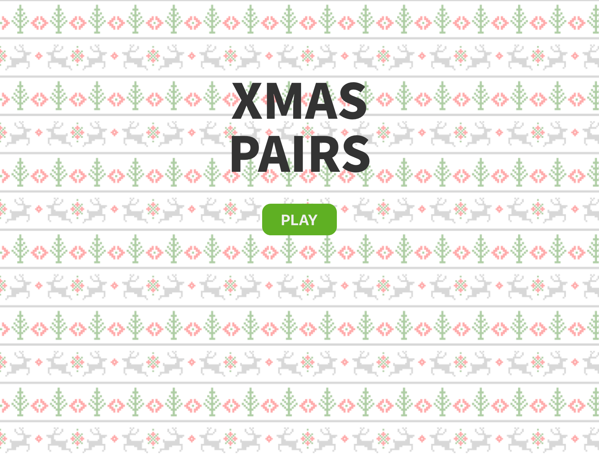

# Christmas Pairs

A festive memory game built with React.

## Getting Started

These instructions will get you a copy of the project up and running on your local machine for development and testing purposes. See deployment for notes on how to deploy the project on a live system.




### Installing

First clone the repository, then download dependencies.

```
yarn
```

Run the app with

```
yarn start
```


## License

This project is licensed under the MIT License.
